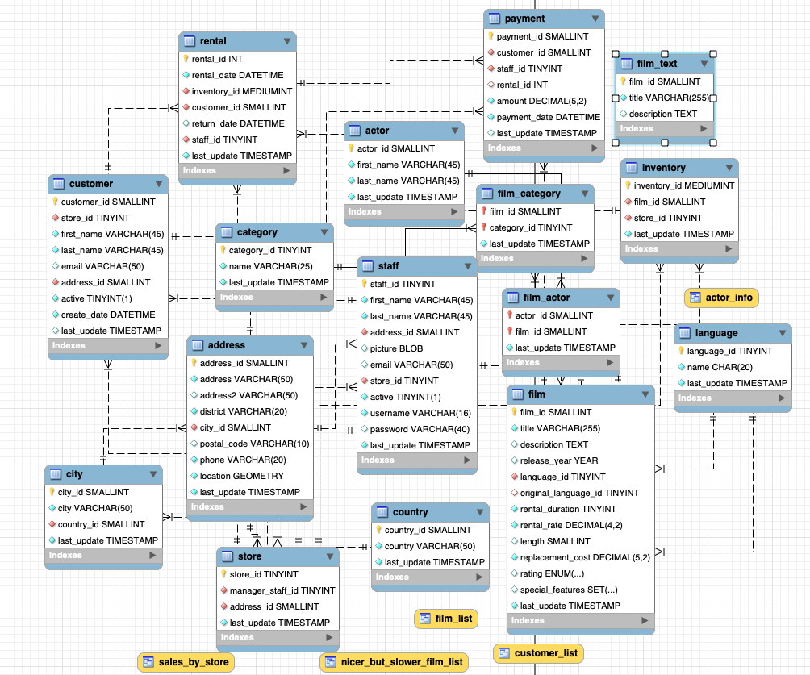

# bda-modulo-2-evaluacion-final-LuanaMagnabosco

Evaluación Final Módulo 2

✅ Para este ejercicio utilizaremos la BBDD Sakila que hemos estado utilizando durante el repaso de SQL.

    📂 Base de Datos Sakila:

	📌 Es una base de datos de ejemplo que simula una tienda de alquiler de películas 🎥

	📌 Contiene tablas como film (películas), actor (actores), customer (clientes), rental (alquileres), 
	category (categorías), entre otras. 🎬 

	📌 Estas tablas contienen información sobre películas, actores, clientes, alquileres y más, 
	y se utilizan para realizar consultas y análisis de datos en el contexto de una tienda de alquiler de películas. 📈 

👉🏻 El enunciado de todas las consultas y el codigo que arroja su resultado están en el archivo Evaluación_final_M2.sql

👉🏻 Este es el diagrama de la BBDD Sakila utilizada en el ejercicio:
